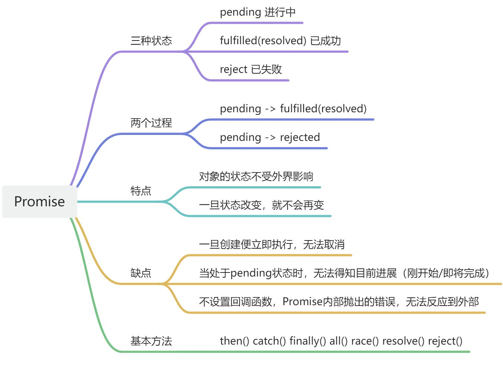

---
# 同时设置分组名称和顺序，order 越小越靠前，默认为 0
group:
  title: Javascript
  order: 2
title: Promise
---

# [JS] 异步编程之 Promise


<a name="MZqib"></a>


## 1、创建一个 Promise 实例

```javascript
const promise = new Promise((resolve, reject) => {
  if(/* fulfilled */) {
    return resolve(value)
  } else {
    return reject(error)
  }
})
```

<a name="dDJpO"></a>

## 2、Promise.prototype.then()

```javascript
promise.then(
  (value) => {
    // resolved
  },
  (error) => {
    // rejected(可选，当第一个回调函数完成后，返回结果作为参数，传入第二个回调函数)
  },
);
```

一般习惯上，不在 then 方法里面定义两个回调函数，对于代码可读性没有帮助，那么 reject 的状态返回，由于 Promise 对象的错误具有“冒泡”性质，会一直向后传递，因此可以用 catch 总能捕获到。
<a name="rqxWo"></a>

## 3、Promise.prototype.catch()

```javascript
promise
  .then((value) => {
    // resolved
  })
  .catch((error) => {
    // 1.rejected
    // 2.then内部发生错误
  });
```

<a name="leW0N"></a>

## 4、Promise.prototype.finally()

该方法是 ES2018 引入标准的

```javascript
promise
  .then((result) => {
    // resolved
  })
  .catch((error) => {
    // 1.rejected
    // 2.then内部发生错误
  })
  .finally(() => {
    // 与状态无关
  });
```

finally 方法的回调函数不接受任何参数，因此，无法在 finally()中知道前面 Promise 的状态是 fulfilled 还是 rejected。表明 finally 方法里面的操作，应该和状态无关，不依赖于 Promise 的执行结果。<br />finally 方法总是会返回原来的值（即在任何一个位置添加 finally 都不会影响原本的输出），本质上是 then 的特例方法。

```javascript
const loading = true;
http.get('/xxx').then(
  (data) => {
    // 处理
    loading = false;
  },
  (data) => {
    // 处理
    loading = false;
  },
);

const loading = true;
http
  .get('/xxx')
  .then(
    (data) => {
      // 处理
    },
    (data) => {
      // 处理
    },
  )
  .finally(() => {
    loading = false;
  });
```

<a name="TgRKD"></a>

## 5、Promise.all([p1, p2])

```javascript
const p1 = new Promise((resolve) => {
  setTimeout(() => {
    console.log('p1');
    return resolve('p1 resolved');
  }, 3000);
});

const p2 = new Promise((resolve) => {
  setTimeout(() => {
    console.log('p2');
    return resolve('p2 resolved');
  }, 1000);
});

Promise.all([p1, p2]).then((result) => {
  console.log(result);
});
```

只有 p1、p2 状态都为 fulfilled，p 的状态才会变成 fulfilled，此时 p1、p2 的返回值组成一个数组，传递给 p 的回调函数。<br /><br />只要 p1、p2 之中有一个被 rejected，p 的状态就变成 rejected，此时第一个被 reject 的实例的返回值，会传递给 p 的回调函数。<br />如果作为参数的 Promise 实例，自己定义了 catch 方法，那么它一旦被 rejected，并不会触发 Promise.all()的 catch 方法。
<a name="iJVQk"></a>

## 6、Promise.race([p1,p2])

只要 p1、p2 之中有一个实例率先改变状态，p 的状态就跟着改变，无论率先的是 resolved 还是 rejected。（案例可参考 all 进行对比）

```javascript
// p1提前被resolved

const p1 = new Promise((resolve) => {
  setTimeout(() => {
    console.log('p1');
    return resolve('p1 resolved');
  }, 1000);
});

const p2 = new Promise((resolve, reject) => {
  setTimeout(() => {
    console.log('p2');
    return reject('p2 rejected');
  }, 3000);
});

Promise.race([p1, p2])
  .then((result) => {
    console.log(result);
  })
  .catch((error) => {
    console.log(error);
  });

// reject同理
```


<a name="snv7K"></a>

## 7、Promise.resolve()

```javascript
Promise.resolve('result');
// 等价于
new Promise((resolve) => resolve('result'));
```

<a name="ZHOVq"></a>

## 8、Promise.reject()

```javascript
Promise.reject('error');
// 等价于
new Promise((resolve, reject) => reject('error'));
```

7、8 两种情况的应用场景有以下几种：<br />**参数是一个 Promise 实例**

```javascript
const p = new Promise((resolve, reject) => {
  // return resolve(0)
});
const promise = Promise.resolve(p);
console.log(promise);
// 打印结果为p这个Promise实例
```

**参数是一个 thenable 对象**

```javascript
let thenable = {
  then: function (resolve, reject) {
    resolve(42);
  },
};
let p1 = Promise.resolve(thenable);
p1.then(function (value) {
  console.log(value); // 42
});
```

**参数不是具有 then 方法的对象，或根本就不是对象**

```javascript
const p = Promise.resolve('Hello');
p.then(function (s) {
  console.log(s);
});
// Hello
```

**不带有任何参数**

```javascript
const p = Promise.resolve();
p.then(function () {
  // ...
});
// 此时是希望得到一个Promise对象
```
